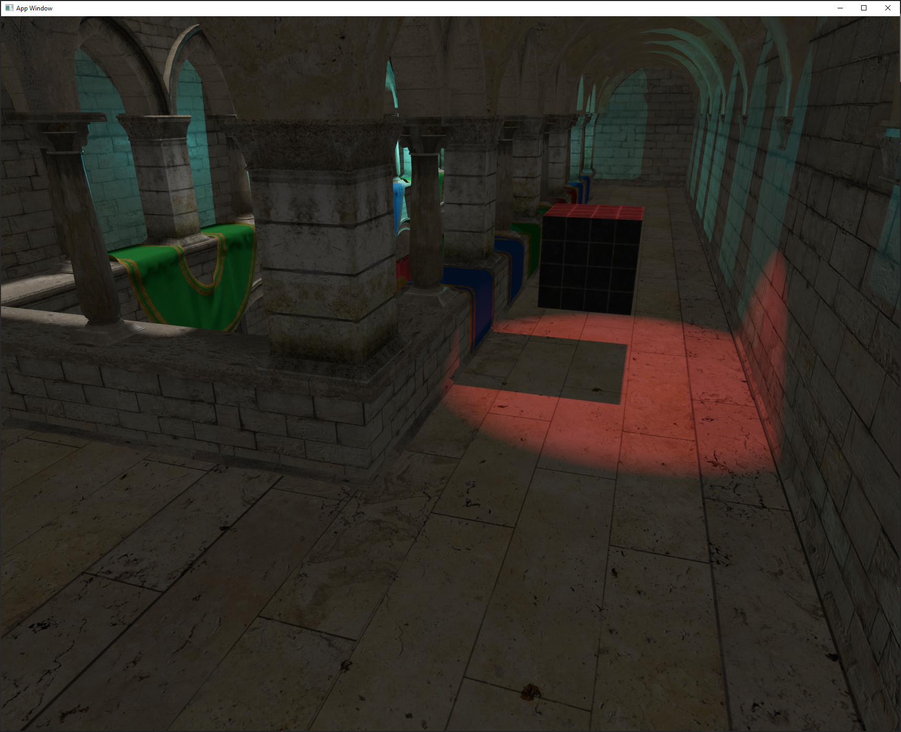

# Vulkan Graphics Engine

## Introduction

Worked on this project to implment different graphic techniques using Vulkan to better understand the graphics API.

## How to run

- Run "GenerateProjects_Windows_VS2022.bat" to generate solution file
- Open "VulkanGameEngine.sln" solution
- Press f5 to run

## How to use

- WASD can be used to move the camera position
- QE can be used to move the camera positon up and down
- Arrows keys can be used to change the look direction of the Camera

## Features Deevloped

- Model Loading using tinygltf
- BRDF Lighting and Shadow Mapping
  - Directional Lighting
  - Point Lights
  - Spot Lights

## Images

**Point Light Shadow**

---

**Directional Light Shadow**

---

**Spot Light Shadow**

## Planned Work

- ~~Premake/Cmake solution for building project files~~
- Serialization to load and unload scenes
- Particle system and Instanced Drawing
- ~~Profiling to improve performance~~ (Need to optimize still)
- ~~fix shadow artifacts for multiple lights~~ (Due light index being corrupted in shader. Fixed)
- Forward Plus rendering using compute shader (1000+ lights)
- Physics Engine
